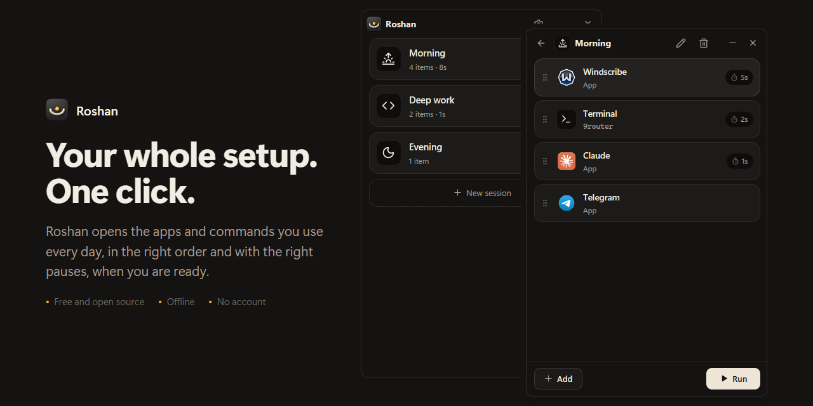
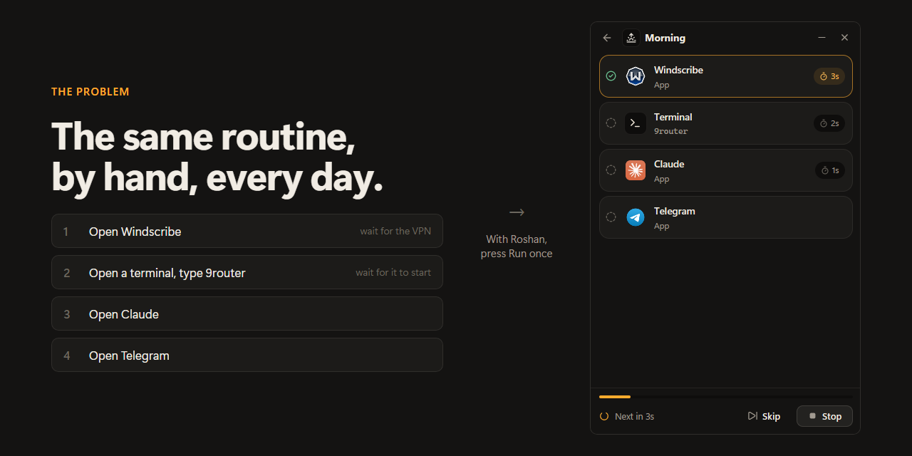
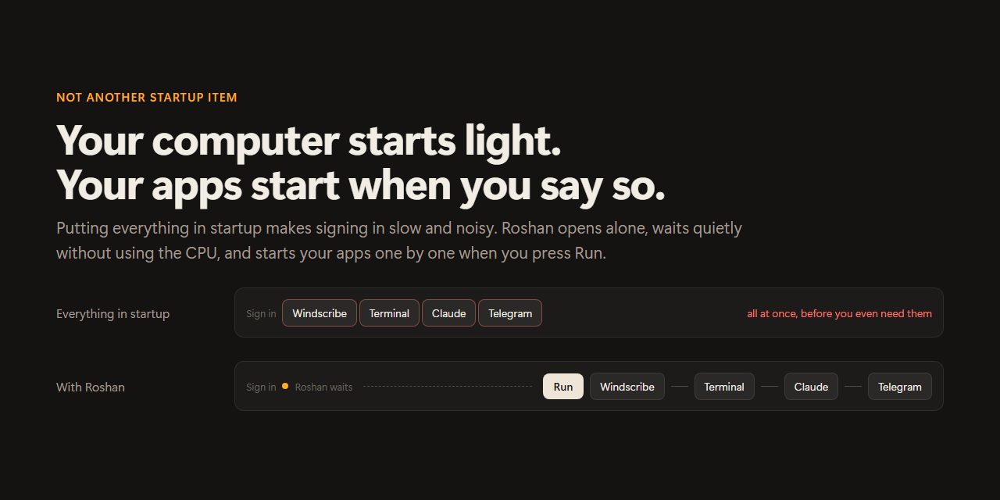
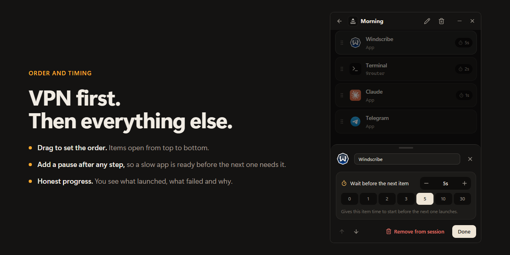
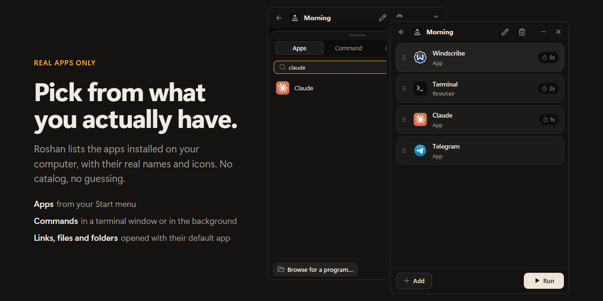
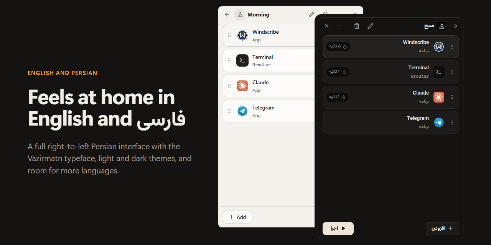

  

<h1 align="center">Roshan</h1>

  Start the apps you use every day in one click, in the right order. 
  Free, open source, and private.

  <a href="https://github.com/sajjadmrx/roshan/releases/latest"><b>Download for Windows</b></a>
  ·
  <a href="#frequently-asked-questions">FAQ</a>
  ·
  <a href="docs/DEVELOPMENT.md">For developers</a>

## The problem

Most mornings look the same. You open your VPN and wait for it to connect.
You open a terminal and start a tool. Then your chat app, your AI assistant,
your browser. Some of them have to wait for the one before. You do it by hand,
in the same order, every single day.

You could put all of it in your startup list. But then everything launches the
moment you sign in, at the same time, and your computer stays slow and noisy
until it settles down. Often before you even need those apps.

## What Roshan does

Roshan lets you save that routine once, as a **session**, and start it with
one click whenever you are ready.

- Your apps open **one after another**, in the order you chose.
- You can add a **short pause** after any step. For example, give your VPN
  5 seconds to connect before anything else opens.
- Your computer still **starts light**. Roshan opens when you sign in, waits
  quietly, and does nothing until you press Run.

## How it works

1. **Create a session.** Give it a name, like "Morning" or "Deep work", and
   pick an icon.
2. **Add what you need.** Choose apps from the ones installed on your
   computer, add a terminal command, or add a link, file or folder.
3. **Press Run.** Roshan opens everything in order and shows you how it went.

## Features

- **Real apps only.** Roshan shows the apps that are actually installed on
  your computer, with their real names and icons.
- **More than apps.** Run a command in a terminal window (or quietly in the
  background), or open a website, a file or a folder.
- **Order and timing.** Drag items to reorder them. Add a pause after any
  item.
- **Honest progress.** You see what launched, what failed and why. If an app
  was uninstalled, Roshan tells you instead of pretending.
- **Several sessions.** Keep one for mornings, one for focused work, one for
  the evening.
- **English and Persian**, with a full right-to-left Persian interface.
- **Light and dark themes**, following your system by default.
- **Stays up to date.** New versions install with one click on Windows.

## Download

Get the latest version from the
[Releases page](https://github.com/sajjadmrx/roshan/releases/latest).

| System  | Status |
| ------- | ------ |
| Windows 10 and 11 | Ready to use |
| macOS   | Built, but not yet tested on a real Mac |
| Linux   | Built, but not yet tested on a real Linux desktop |

On Windows, download **Roshan-Setup** and run it. It installs just for you,
with no administrator rights, adds Roshan to the Start menu, and can be
removed any time from **Settings → Apps**. The first time Roshan opens, it asks
which language you prefer. After that, it keeps itself up to date.

> **Windows may warn you** when you run the setup ("Windows protected your
> PC"). This happens with new apps that are not signed with a paid
> certificate. Click **More info**, then **Run anyway**. The source code is
> right here if you want to check what it does.

When you uninstall Roshan, it asks whether to delete your sessions too. Your
sessions are kept unless you say otherwise.

## Your privacy

- Roshan works **without an internet connection**. The only thing it ever
  asks the internet is whether a new version of Roshan is out (see below).
- There is **no account**, no tracking and no analytics.
- Your sessions are saved in one small file on your own computer.
- Nothing runs until you press Run.

## Frequently asked questions

**Is Roshan a startup manager?**
No. A startup manager opens apps automatically when you sign in. Roshan does
the opposite: it keeps your sign-in light and waits for you to decide when your
apps should start.

**Will it slow down my computer?**
No. While it waits, Roshan uses no processor time and very little memory. It
does not run anything in the background.

**Does Roshan know when my VPN has connected?**
No, and it does not pretend to. It opens each app and then waits the number of
seconds you set before opening the next one. Choose a pause that fits your VPN.

**Can it run terminal commands?**
Yes. Add a **Command**, type it exactly as you would in a terminal, and choose
whether it opens in a terminal window or runs quietly in the background.

**How does Roshan update itself?**
Once a day, Roshan asks GitHub whether a new version has been released.
Nothing about you or your sessions is sent. On Windows, a new version is
downloaded in the background and checked against its published checksum,
then Roshan shows **Restart to update**. Nothing restarts until you click it.
On macOS and Linux, Roshan tells you a new version is out and links to it.
You can turn automatic checks off in **Settings**, and check by hand with
**Check now**.

**Can I stop Roshan from opening when I sign in?**
Yes. Open **Settings** and turn off **Open when you sign in**.

**Something did not open. What now?**
Roshan shows the reason next to the item, in the words your system gave. If
an app was moved or uninstalled, remove it and add it again.

## Help make Roshan better

Roshan is free and open source. Bug reports, ideas and translations are all
welcome. See [CONTRIBUTING.md](CONTRIBUTING.md) to get started, and
[docs/DEVELOPMENT.md](docs/DEVELOPMENT.md) for how it is built.

## License

Roshan is released under the [MIT License](LICENSE). It includes icons from
[Lucide](https://lucide.dev) and the
[Vazirmatn](https://github.com/rastikerdar/vazirmatn) typeface. See
[docs/DEVELOPMENT.md](docs/DEVELOPMENT.md#licenses-of-bundled-material) for
details.

---

### روشن به فارسی

روشن یه ابزار کوچیک و آفلاینه. برنامه‌ها، دستورها و لینک‌هایی که هر روز باز
می‌کنی رو توی «روتین»ها بچین تا روشن اون‌ها رو به ترتیب و با فاصله‌ی زمانی
دلخواهت اجرا کنه. فقط برنامه‌هایی رو می‌بینی که واقعا روی سیستمت نصب‌ان، با
اسم و نماد واقعی خودشون. بدون حساب کاربری، بدون اینترنت و بدون ردیابی

